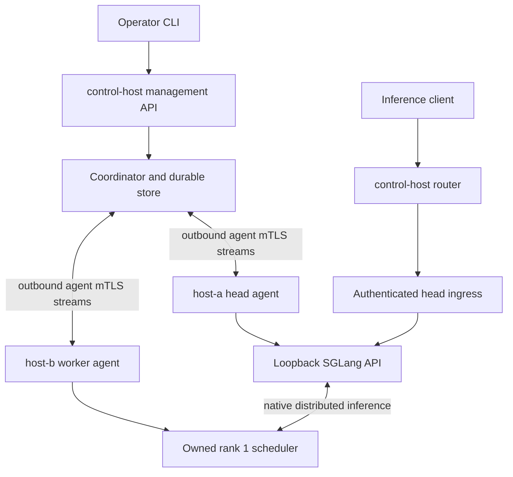
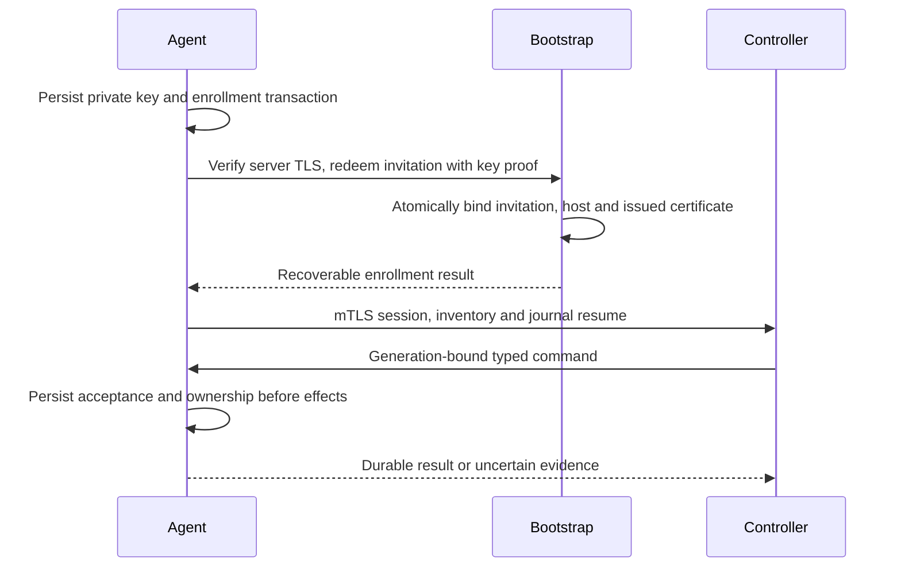
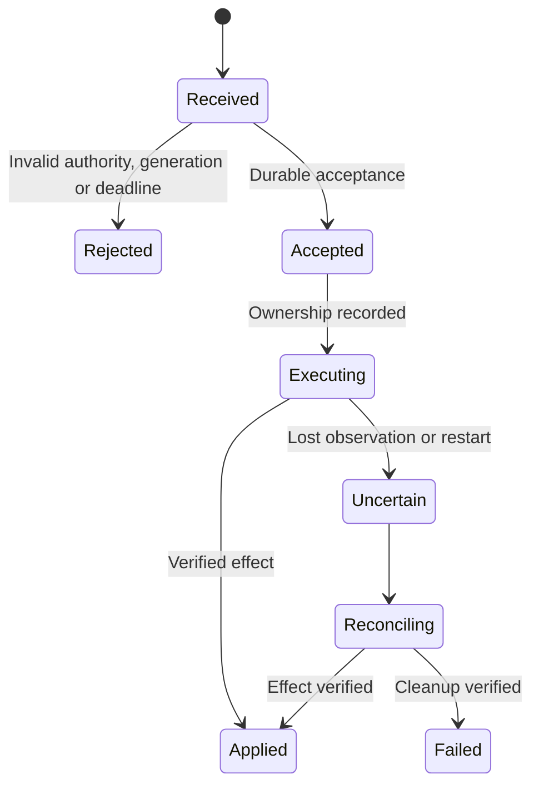
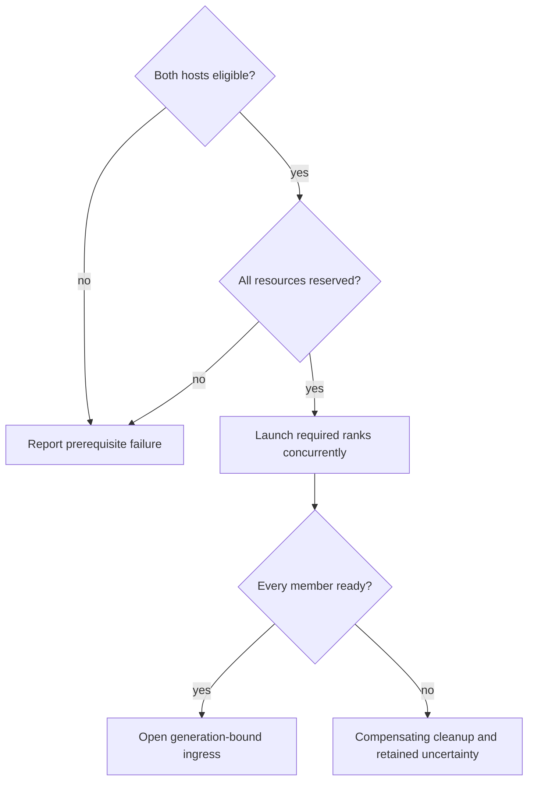

# Two-Spark SGLang Product Operation - Plan

## Goal Capsule

- **Objective:** An operator on control-host can deploy, serve, recover and stop a SGLang model distributed across host-a and host-b through mllm.
- **Means:** Extend the existing coordinator with authenticated host agents and a separately pinned two-node recipe (KTD1–KTD5).
- **Authority:** `docs/SPEC.md`, then `docs/design/milestones/f2-sglang-design.md`, then this plan. Execution status belongs only in `docs/runbooks/f2-current-status.md`.
- **Execution:** Implement in dependency order on the current branch, preserve unrelated changes, and run focused regressions before integration checks. The existing user authorization covers continuing product work and live validation on both Sparks.
- **Completion:** The executor owns implementation, product validation and one consolidated code review. No push, merge or publication is implied.
- **Stop conditions:** A failed prerequisite closes its native path. Report an unavailable host or missing permission without substituting shell-managed inference for product operation.

---

## Product Contract

### Summary

Add remote host operation and distributed SGLang operation to the shipped CLI and management API.
Use control-host as the control plane and both Sparks as supervised inference hosts.
The distributed baseline proves launch, inference, failure recovery and cleanup; the complete F4 gate additionally requires the switching and cache evidence specified in SPEC §18.

### Problem Frame

The current standalone product has served native SGLang 0.5.20 requests on host-a.
Remote role startup and enrollment remain stubs, and the native recipe admits only one node.
Independent standalone processes cannot establish distributed ownership, resource accounting or recovery.

### Key Decisions

- **Use the product for validation.** Governs R1, R2. (session-settled: user-directed — chosen over manual launch workarounds: fixes must exercise the shipped product.)
- **Use SGLang 0.5.20.** Governs R3. (session-settled: user-approved — chosen over retaining the modified older installation: clean installation and reviewed source identity.)
- **Standalone is a prerequisite.** Governs R2, R10. (session-settled: user-directed — chosen over stopping at standalone success: the requested outcome spans both Sparks.)

### Requirements

**Product operation**

- R1. Role startup, enrollment, deployment intent and lifecycle actions use the shipped CLI/API under SPEC §§3–4 and §14.
- R2. One managed deployment spans both Sparks, with control-host routing authenticated inference and each host agent supervising its owned member under SPEC §11.
- R3. Both members use the reviewed SGLang 0.5.20 build and matching checkpoint contract; driver changes, rebooting and unrelated environment changes remain excluded.

**Trust and recovery**

- R4. Enrollment, renewal, revocation and connection identity meet SPEC §4.1 and §13.3, including local private keys and recoverable one-use invitation redemption.
- R5. Commands preserve durable acceptance, generation fencing and evidence-based settlement across response loss and process restart under SPEC §13.
- R6. Resource and process identities are scoped to their enrolled host, and uncertain ownership retains accounting under SPEC §§7 and 11.
- R7. Ingress admits only the current ready group and rejects stale authorization under SPEC §10; inference bodies never enter the control journal.

**Native evidence**

- R8. Group launch reserves all members before effects and requires evidence from every member before routing under SPEC §11.
- R9. Deep park and collective paths require explicit host-policy opt-in and all-member evidence under SPEC §9.1, §11 and T21.
- R10. Complete this task with product-controlled two-Spark inference, failure recovery and cleanup; report the broader F4 switching, residency and cache gates separately under SPEC §18.

### Actors and Flows

- A1. The administrator operates the CLI on control-host and prepares approved host profiles.
- A2. The server owns durable deployment intent, reservations and public inference admission.
- A3. Each host agent owns local credentials, approved execution and physical evidence.
- F1. Initialize server → invite → join each host → connect → reconcile inventory and eligibility (R1, R4–R6).
- F2. Submit deployment → preflight both members → reserve group → start ranks → collect readiness → route inference (R2, R3, R7, R8).
- F3. Lose acknowledgement or connectivity → retain ownership → reconnect → reconcile known commands → settle from evidence (R5, R6).
- F4. Drain → one lead collective → collect all-member release/restore evidence → admit the selected deployment (R9, R10).

### Acceptance Examples

- AE1. After an enrollment reply is lost, the same persisted transaction and key recover one host identity; another key cannot reuse the invitation. Covers R4.
- AE2. When the worker disconnects while the head responds, no competing activation consumes its retained reservation. Covers R6–R8.
- AE3. When a launch acknowledgement is lost, reconnect discovers the original owned process rather than launching another. Covers R5.
- AE4. A worker health listener returning 200 cannot open the deployment route without scheduler evidence and successful head inference. Covers R7, R8.
- AE5. A partial collective never frees the unresolved rank's resources or triggers a blind repeated collective. Covers R6, R9.

### Scope Boundaries

The initial distributed recipe is TP=2, PP=1, DP=1 with one GB10 per host.
Other parallel layouts, active-active controllers, arbitrary remote shell execution and automatic engine installation are outside this implementation.
U8 completes the requested distributed test.
Unsupported persistent/shared cache combinations remain explicitly unsupported rather than gaining an inferred certification.
The broader mixed-engine F2 program remains governed by its existing design; this plan does not declare that milestone complete.

### Deferred to Follow-Up Work

U9 records the separate F4 residency, switching and cache qualification required before advertising those capabilities.
It is not a prerequisite for completing this task's distributed inference and recovery test.

---

## Planning Contract

### Key Technical Decisions

- KTD1. **Reuse the production coordinator and store.** Add host execution and observation ports beneath existing durable lifecycle transitions; no second remote controller. This follows SPEC §18 and ADR 0009.
- KTD2. **Use agent-initiated gRPC with mutual TLS.** Enable the existing tonic 0.13.1 TLS support and bind verified peer certificates to persisted host identities. Bootstrap uses a separate server-authenticated endpoint per SPEC §4.1; the older program's deferred-mTLS note cannot override that requirement.
- KTD3. **Persist typed commands before effects.** The agent journal binds a per-step command ID to controller, host, member, operation, immutable payload digest and assignment generation. A known result is replayable, while ambiguous effects require inspection. Compact completed payloads only after retaining a durable rejection watermark or tombstone that prevents old delivery from executing again. Do not execute the existing protobuf `rendered_command_json` as remote authority; agents render approved profiles locally.
- KTD4. **Keep inference on a separate private HTTP ingress.** Only the head agent exposes an authenticated, generation-checked inference route to the server. Native admin endpoints remain loopback and inference-only path/method allowlists apply.
- KTD5. **Add a distinct distributed SGLang recipe.** Preserve the standalone recipe's restrictions. The new recipe pins commit `94602c9c2b7cbdb8efd5c52802dac6a1c180089e`, rank topology, rendezvous and worker startup sources for R3 and R8. Both ranks start concurrently because initialization waits on peers.
- KTD6. **Namespace ownership without inventing capacity.** Use enrolled host ID plus local domain/device/member identity. Local process identity retains PID, boot/start identity and owned handle; cross-host aggregation never compares raw PIDs as globally unique.
- KTD7. **Make debug output an explicit local choice.** Extend the established default-off `--debug-engine-logs` behavior to host startup. Preserve private file permissions and keep raw logs out of API responses and journals under SPEC §13.3.

### High-Level Technical Design

These sketches describe required boundaries; exact internal interfaces may follow existing crate patterns.

Component topology and inference flow (KTD1, KTD2, KTD4):



Enrollment and delivery sequence (KTD2, KTD3):



Command lifecycle and restart recovery (KTD3):



Group admission decisions (R6–R8):



Role and debug option behavior (R1, KTD7):

| Role | Engines required at startup | Enrollment | Full native logs |
|---|---|---|---|
| standalone | Existing local profile rules | Embedded host | Explicit local flag only |
| server | No | Empty inventory initially | No local native engine |
| host before join | No | Explain join; no guessed server | No native launch |
| joined host | No eligible profile required | Saved identity | Explicit local flag only |
| joined host after revocation | No new work | Explicit recovery policy | No permission change |

API sketch (R1, R4, R5): authenticated invitation issuance and host revocation live on management HTTP; enrollment and certificate renewal have versioned protocol messages; the agent session exchanges prepare, execute, inspect, ingress-gate and result-replay messages.
Every effectful request carries a recoverable client request identity, and every result names its accepted operation.

### Risks and Dependencies

The current protocol is scaffolding, not an established remote compatibility contract.
Preserve existing field numbers and reject incompatible schema versions explicitly.
New store migrations must preserve existing standalone ownership; missing host provenance cannot be guessed from a name.

The approved 0.5.20 installation is available on host-a; host-b still requires equivalent preparation before native launch.
Validate checkpoint identity and actual inter-host collective connectivity before opening the recipe.
An available rendezvous port alone does not prove the native communication path works.

Pinned SGLang starts a dummy health server on nonzero node ranks after scheduler initialization.
Its `/health_generate` always returns 200, so U7 must consume scheduler evidence rather than treat that endpoint as a generation probe.

### Sources

- `crates/mllm-protocol/proto/mllm/management/v1/management.proto`: current envelopes and transport scaffolding.
- `crates/mllm-store/src/ordinary_lifecycle.rs` and `crates/mllm-launchers/`: durable acceptance and gated spawn patterns.
- `crates/mllm-cli/src/roles.rs` and `crates/mllm-cli/src/client.rs`: role stubs and current management client.
- [Tonic 0.13.1 TLS features](https://github.com/hyperium/tonic/blob/v0.13.1/tonic/Cargo.toml) and [verified peer certificates](https://docs.rs/tonic/0.13.1/tonic/struct.Request.html#method.peer_certs).
- [gRPC cancellation](https://grpc.io/docs/guides/cancellation/) and [flow control](https://grpc.io/docs/guides/flow-control/): cancellation is not rollback; a stream write is not a durable acknowledgement.
- [Pinned SGLang startup](https://github.com/sgl-project/sglang/blob/94602c9c2b7cbdb8efd5c52802dac6a1c180089e/python/sglang/srt/entrypoints/engine.py), [worker health](https://github.com/sgl-project/sglang/blob/94602c9c2b7cbdb8efd5c52802dac6a1c180089e/python/sglang/srt/utils/common.py), and [distributed bootstrap](https://github.com/sgl-project/sglang/blob/94602c9c2b7cbdb8efd5c52802dac6a1c180089e/python/sglang/srt/distributed/bootstrap.py).

---

## Implementation Units

### U1. Host-scoped group and execution contracts

- **Goal:** Represent a group without confusing identities on different hosts.
- **Requirements:** R5, R6, R8; KTD3, KTD6.
- **Files:** `crates/mllm-domain/src/`, `crates/mllm-protocol/proto/mllm/management/v1/management.proto`, `crates/mllm-protocol/tests/wire_roundtrip.rs`, `crates/mllm-store/src/lifecycle/completion.rs`.
- **Approach:** Add validated member plans, host-scoped evidence and typed remote commands; preserve local lifecycle behavior through explicit conversion. Replace singleton policy lookup with explicit host selection and migrate embedded-host ownership to a durable identity. Reject unsupported topology before launch.
- **Test scenarios:** Equal PIDs on different hosts remain distinct; duplicate ranks or devices on one host fail; reused PID with another start identity fails; missing member evidence cannot settle a group; old protocol payloads cannot bypass validation. Upgrading populated standalone state preserves active reservations and ownership, while ambiguous legacy provenance fails closed.
- **Verification:** Domain and protocol tests plus existing local identity/lifecycle targets.

### U2. Persisted enrollment and certificate lifecycle

- **Dependencies:** U1.
- **Goal:** Enroll and authenticate each host without sharing administrator credentials.
- **Requirements:** R1, R4; F1, AE1; KTD2.
- **Files:** `crates/mllm-store/src/migrations.rs`, new enrollment store module, `crates/mllm-protocol/src/`, `crates/mllm-management/src/`, `crates/mllm-agent/src/`.
- **Approach:** Store invitation digests and enrollment transaction bindings atomically; issue host-scoped certificates from a protected server CA. Bind mTLS peers to the registry and implement renewal/revocation before advertising remote control.
- **Test scenarios:** Concurrent redemption yields one identity; expired invitation fails; lost response recovers the same certificate transaction; changed key/name fails; untrusted server receives no secret; renewal preserves host ID; revocation closes an existing session and denies new commands.
- **Verification:** T05, T06, T37 through real TLS client/server integration, including wrong-certificate rejection.

### U3. Durable host command acceptance and reconciliation

- **Dependencies:** U1.
- **Goal:** Recover accepted effects without duplicate launch or premature release.
- **Requirements:** R5, R6; F3, AE3; KTD1, KTD3.
- **Files:** `crates/mllm-agent/src/`, `crates/mllm-launchers/src/`, `crates/mllm-store/src/`, new agent journal integration tests.
- **Approach:** Add a private transactional agent journal and one host resource lock. Reuse gated spawn, approved profile rendering and owned-handle inspection. Bound completed-result retention without deleting unresolved ownership.
- **Test scenarios:** Lost acknowledgement after spawn produces one process; changed payload under the same command ID fails; expired queued command never starts; accepted uncertain work remains charged; agent restart detects PID reuse; duplicate collective delivery never repeats an ambiguous collective. Two steps within one operation have distinct identities, and replay after result compaction cannot execute again.
- **Verification:** T09, T12, T13, T33, T34 with controlled child processes and crash boundaries.

### U4. Server and host roles with outbound sessions

- **Dependencies:** U2, U3.
- **Goal:** Start an empty GPU-free server and reconnect enrolled hosts through the product.
- **Requirements:** R1, R4–R6; F1; KTD1–KTD3, KTD7.
- **Files:** `crates/mllm-cli/src/{grammar,main,roles,client}.rs`, `crates/mllm-config/src/`, `crates/mllm-agent/src/`, `crates/mllm-protocol/src/`.
- **Approach:** Implement strict role configuration, initialization/join commands and authenticated session lifecycle. Progress reads and bounded writes independently; reconcile before accepting new transitions after restart.
- **Test scenarios:** Server starts without CUDA or engine paths; enrolled unprepared host is online but ineligible; missing explicit config fails without fallback; reconnect preserves identity; stale session cannot report new authority; stalled reader cannot cause unbounded buffering; host debug flag defaults off.
- **Verification:** T01–T07, T33, T34 using shipped binaries and real local transport.

### U5. Remote lifecycle and private inference ingress

- **Dependencies:** U4.
- **Goal:** Manage a remote single-host deployment through control-host before combining ranks.
- **Requirements:** R1, R5–R7; KTD1, KTD4.
- **Files:** `crates/mllm-controller/src/`, `crates/mllm-management/src/`, `crates/mllm-router/src/`, `crates/mllm-cli/src/client.rs`, agent ingress module.
- **Approach:** Resolve configuration against the enrolled host registry and adapt existing lifecycle execution to remote commands. Add durable/reusable client request identity for response-loss recovery. Preserve administrative stop semantics and propagate generation-bound ingress authorization.
- **Test scenarios:** CLI crash does not cancel accepted work; a repeated request identity returns the original operation; administrative stop blocks autoactivation; stale gate token and admin path fail; inference streams bypass command journals; remote disconnect retains in-flight request accounting.
- **Verification:** T08–T10, T18, T37, T38 through CLI → server → agent → controlled engine, then native host-a operation.

### U6. Group reservation, fanout and settlement

- **Dependencies:** U5.
- **Goal:** Coordinate both hosts through one existing lifecycle authority.
- **Requirements:** R2, R6–R8; F2, AE2; KTD1, KTD6.
- **Files:** `crates/mllm-store/src/{resource_policy,ordinary_lifecycle}.rs`, `crates/mllm-controller/src/`, configuration normalization and group tests.
- **Approach:** Validate all member preparations, reserve host-scoped resources in one server transaction, and dispatch rank starts without a readiness dependency between members. Bind preparation to boot identity, policy revision, profile fingerprint and devices; agents revalidate under the local resource lock immediately before effects. Aggregate evidence and compensate failures per member.
- **Test scenarios:** Competing overlapping group plans cannot partially acquire resources; second host preflight failure starts neither member; one failed rank keeps routing closed; head death with surviving worker preserves ownership; disconnect/lease expiry never frees a device; all-member cleanup permits a fresh generation. Policy change or reboot between preparation and execution rejects the stale plan without releasing unresolved reservations.
- **Verification:** T23, T26, T27, T29–T34 with deterministic two-agent fault tests.

### U7. Pinned SGLang two-node native recipe

- **Dependencies:** U6.
- **Goal:** Launch TP2 SGLang with source-verified worker behavior.
- **Requirements:** R2, R3, R8; AE4; KTD5.
- **Files:** `crates/mllm-config/src/effective/sglang.rs`, `crates/mllm-adapters/src/sglang/`, `runtime/sglang_*.py`, corresponding runtime tests and recipe documentation.
- **Approach:** Add explicit rank/rendezvous descriptors and node-role startup handling. Extend source audits to every newly trusted distributed path and reject environment overrides that change the plan. Publish scheduler-bound readiness and identities on worker-only nodes.
- **Test scenarios:** TP2 with two distinct approved devices passes normalization; mismatched fingerprints/checkpoints fail; duplicate rank or unexpected rendezvous override fails; dummy worker HTTP health alone fails readiness; standalone recipe retains its original restrictions.
- **Verification:** T14, T22, T27, T30 plus native two-rank startup through product roles.

### U8. Distributed product baseline and failure recovery

- **Dependencies:** U7.
- **Goal:** Prove real two-Spark generation and owned cleanup from control-host.
- **Requirements:** R1–R8; F1–F3; KTD1–KTD6.
- **Files:** Existing live runbook and product-driven live tests/scripts under `scripts/live/`; non-secret evidence under `target/live/`.
- **Approach:** Prepare matching approved environments, enroll both hosts, and use only shipped lifecycle commands. Record both rank identities, physical resource use, routed inference and final cleanup. Exercise head failure, worker connection loss and controller/agent restart with retained ownership.
- **Test scenarios:** Repeated start/inference/stop succeeds; lost worker blocks competing activation; head crash leaves a tracked worker; reconciliation permits verified group recovery; stopped group has no owned processes on either host.
- **Verification:** Native T30–T34 and T38 evidence, independently from CPU/Fake results. Baseline completion is not R10 completion.

### U9. All-member residency and F4 verification (follow-up)

- **Dependencies:** U8 and the existing F2 native residency prerequisites.
- **Goal:** Complete the separate F4 behavior distinguished by R10.
- **Requirements:** R6, R9, R10; F4, AE5.
- **Files:** SGLang observer/runtime modules, controller group settlement, store resource evidence and existing live runbook.
- **Approach:** Extend release/restoration observation to every rank, preserve single-lead collective dispatch and make capability admission conditional on complete evidence. Exercise two prepared deployment profiles under aggregate pressure and supported cache configurations.
- **Test scenarios:** A → B → A serves the correct model; partial release or lost collective reply closes admission and retains unresolved accounting; worker failure recovers without blind collective replay; supported retained caches show declared hit/miss and quota behavior.
- **Verification:** Native T16, T20–T24, T30–T36 and the SPEC §18 F4 gate. A missing observer or unsupported cache prerequisite stays an explicit incomplete gate.

---

## Verification Contract

Tag tests with the governing acceptance-matrix IDs and cite SPEC requirements inline where behavior depends on them.
CPU and Fake-engine tests prove contracts only; they never qualify a native recipe.

The authoritative integration command is:

```bash
cargo test -p mllm-adapters -p mllm-store -p mllm-controller -p mllm-management -p harness --all-targets --no-fail-fast --locked -- --test-threads=4
```

Run Clippy with warnings denied across those crates, plus affected agent/protocol/config/router crates.
Run explicit CLI targets instead of CLI `--all-targets` so the owner's excluded interactive test is never read or executed.
Use the existing runtime Python suite for source, launch and observer regressions.
Count the nested owned-state child summary only once.

Live evidence must identify engine source, checkpoint, both host identities, topology, deployment revision/generation, operations, per-host resource observations, routed responses and final owned-handle cleanup.
Keep credentials and raw debug logs in private host files; retain only non-secret evidence in `target/live/`.
Update `docs/runbooks/f2-current-status.md` in place after each material gate.

---

## Definition of Done

Units U1–U8 satisfy their stated scenarios, integration remains green, and consolidated review has no unresolved correctness or security findings.
U8 completes the requested multi-node test; it does not complete the separate F4 qualification recorded in follow-up U9.
The shipped CLI/API reproduces the result without direct database mutations or manual engine launches.
Both Sparks have verified ownership and cleanup after each failure scenario, with unresolved resources still charged.
Remove abandoned implementation attempts, preserve unrelated owner changes, and leave one accurate status runbook.
