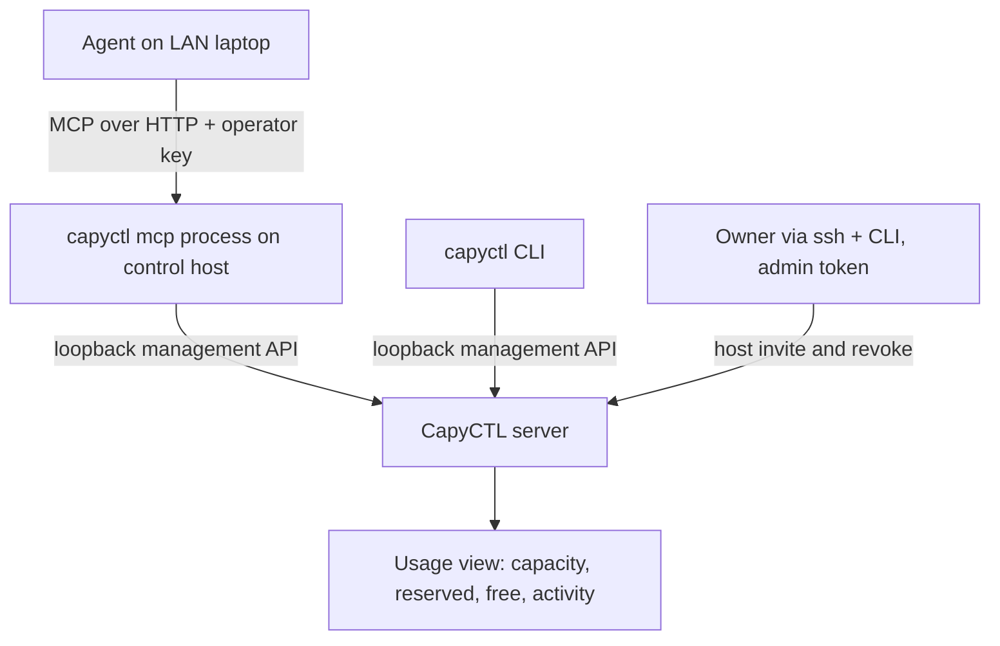

# MCP Server for Agents - Plan

## Goal Capsule

- **Objective:** An AI agent on the owner's network can connect to CapyCTL over MCP, see what is running and how loaded each host is, and operate deployments, using the same answers the CLI gives.
- **Product authority:** `docs/SPEC.md` first, then the ADRs in `docs/design/adr/`, then this plan. Network-reachable management commands amend ADR 0019 §10 and SPEC §13.3, so a new ADR recording these owner decisions is a prerequisite of shipping.
- **Open blockers:** None for planning. The new ADR must be accepted before the feature ships.

---

## Product Contract

### Summary

Add a `capyctl mcp` command that runs an MCP server as its own process on the control host, serving MCP over HTTP to agents on the network behind a new remote-operator key.
The process talks to CapyCTL only through the existing loopback management API and mirrors the operator part of that API as MCP tools.
Add one new management API usage view, shown by a CLI command and mirrored by MCP, that answers what is running, how loaded each host is, and what could be freed.

### Problem Frame

CapyCTL is operated today through the CLI on the control host, or by `ssh` plus the CLI from elsewhere (ADR 0019 §10).
MCP-capable agents, such as coding assistants and desktop chat apps, increasingly run on the owner's laptop, not on the control host, and have no supported way to reach CapyCTL.
The owner's first questions for such an agent are operational: what is running, what is the load on a given host, and what can be freed.
Those answers exist only as raw pieces today: host domain capacity in the hosts view, per-deployment reservations in the ledger snapshot, and request histograms in the latency metrics.
A human or an agent has to join them by hand, so the same question is hard to answer from the CLI as well.

### Architecture at a glance

The management listener stays on loopback.
Only the `capyctl mcp` process is network-reachable, and only while it runs.

### Key Decisions

- **HTTP transport for agents on other machines.** Agents usually run on a different machine from the control host, so MCP is served over HTTP rather than only over local stdio or an SSH tunnel. (session-settled: user-directed — chosen over loopback-only HTTP reached through an SSH or Tailscale tunnel: agents and a future web app should connect directly.)
- **A third credential: the remote-operator key.** The key is distinct from the inference API key and the loopback admin token. This keeps SPEC §13.3's rule that remote control and ingress use distinct identities, and lets the admin token stay the root of trust. (session-settled: user-approved — chosen over reusing the admin token on a network bind or using the inference key: one leaked secret would otherwise grant root control or let any inference client operate the fleet.)
- **The operator key is a full deployment operator, not an administrator.** It covers every operator action, while host invitation and host revoke stay on loopback with the admin token. (session-settled: user-approved — chosen over full parity and over remote revoke-only: a network key able to enroll hosts could add a rogue machine that then receives workloads.)
- **`capyctl mcp` is its own process.** It runs in the foreground by default, with a flag to run in the background, and talks to the loopback management API. Nothing is exposed unless it is running. (session-settled: user-directed — chosen over a persistent enable switch inside the server: the server and its loopback rule stay unchanged, and MCP cannot destabilize the control plane.)
- **Mirror the management API rather than design agent-specific views.** MCP tools map closely to management API operations, so MCP stays a thin layer in lockstep with the API. (session-settled: user-directed — chosen over curated agent-only operator views and over a server-side advisor that plans what to free: questions worth asking an agent are also worth asking the CLI, so their answers belong in the API.)
- **The usage answer is computed once, in the management API.** A new usage view joins capacity, reservations and request activity, and the CLI and MCP both present it. (session-settled: user-approved — chosen over leaving agents to derive it from raw routes: every client gets the same numbers.)
- **Action tools wait for the outcome up to a deadline.** On timeout they report that the operation is still in progress and how to resume waiting. (session-settled: user-approved — chosen over returning immediately and over streaming progress notifications: agents tend to treat a returned call as done, and notification support varies across clients.)

### Actors

- A1. Owner: runs `capyctl mcp`, holds the operator key, configures the agent client, and keeps admin-only actions on the control host.
- A2. Agent: an MCP client on the owner's network, usually on another machine, acting with the operator key.
- A3. CLI user: asks the same usage questions from a terminal through the new CLI command.
- A4. CapyCTL server: the only authority on state; it computes the usage view and executes actions.

### Requirements

**Process and lifecycle**

- R1. `capyctl mcp` runs the MCP server in the foreground until stopped.
- R2. A flag runs the same server in the background, with a supported way to stop it and to check whether it is running.
- R3. The MCP process reaches CapyCTL only through the loopback management API and never through engine listeners or the inference router.
- R4. When `capyctl mcp` is not running, no MCP or remote management surface is reachable.
- R5. `capyctl mcp` runs on the control host in both the server and standalone roles.

**Access and credentials**

- R6. Every MCP request must present the remote-operator key, and a request without a valid key is refused before any tool runs.
- R7. The operator key is distinct from the inference API key and the admin token, and the inference key never authorizes an MCP request.
- R8. On first run, `capyctl mcp` creates the operator key, stores it owner-only, and prints it once together with a ready-to-paste client configuration.
- R9. The operator key persists across runs, so a configured client keeps working after a restart.
- R10. The owner can rotate the operator key, and rotation invalidates the old key.
- R11. The key is never logged, never returned by a tool, and never included in management responses.
- R12. The MCP listener may bind to a non-loopback address. CapyCTL does not terminate TLS for it, matching the inference endpoint's reverse-proxy guidance.

**Tool surface**

- R13. MCP exposes the management API's operator operations: the read views (snapshot, deployments, deployment detail, effective config, hosts, engines list, model sources, latency metrics, recent events) and the new usage view.
- R14. MCP exposes every deployment lifecycle action the management API supports, at the deployment and the instance level, plus deploy, delete and host drain.
- R15. Host invitation and host revoke are not reachable through MCP under any configuration.
- R16. Read tools that can return large results accept a filter by host and by deployment, so an agent can ask about one host without receiving the whole ledger.
- R17. Each tool describes its effect clearly enough for an MCP client to flag destructive or disruptive calls (delete, stop, drain) to its user.
- R18. Tool results carry the same identifiers, states and error codes as the management API, so an agent's answer can be checked against the CLI.

**Action semantics**

- R19. Action tools keep the management API's guarantees: an idempotency key, the expected revision, and durable acceptance before the call returns.
- R20. An action tool waits until the operation reaches a terminal outcome or the caller's deadline, whichever comes first.
- R21. On deadline expiry, the tool reports that the operation is still in progress, with its operation identifier, and a wait tool resumes waiting on it.
- R22. Waiting never retries or replays an action. A repeated call with the same idempotency key returns the original operation.

**Usage view**

- R23. The management API offers a usage view that reports, per host memory domain, capacity, reserved and free bytes.
- R24. The usage view reports, per deployment and instance, the host and domains it occupies, the bytes it holds in each, its lifecycle state, and its recent request activity.
- R25. Recent request activity distinguishes deployments serving requests now from ones idle for a stated period, not only lifetime totals.
- R26. When a figure is unknown or stale, the view says so rather than reporting a number.
- R27. A CLI command shows the usage view as text by default and as JSON on request, per ADR 0021.

**Governance**

- R28. A new ADR records these owner decisions and amends the relevant text of ADR 0019 §10 and SPEC §13.3.
- R29. Operator docs cover starting `capyctl mcp`, connecting a client, key rotation, and exposure guidance next to `docs/operations/network-access.md`.
- R30. Tests are tagged with their acceptance-matrix IDs, and the security tests extend T37's boundaries to the MCP listener.

### Key Flows

- F1. First connection
  - **Trigger:** The owner wants an agent on a laptop to manage CapyCTL.
  - **Actors:** A1, A2
  - **Steps:** The owner runs `capyctl mcp` (or its background form) on the control host. The first run creates the operator key and prints the URL, key and client snippet. The owner pastes the snippet into the agent's MCP configuration. The agent lists tools and calls one.
  - **Outcome:** The agent is connected, and the key keeps working across restarts.
  - **Covered by:** R1, R2, R6, R8, R9

- F2. "What is running, how loaded is host B, what can go"
  - **Trigger:** The owner asks the agent the question.
  - **Actors:** A1, A2, A4
  - **Steps:** The agent calls the usage tool filtered to host B. It reports free and reserved memory per domain, which deployments hold it, and which of them are idle. It then proposes parking or stopping the idle ones.
  - **Outcome:** The owner sees the same numbers `capyctl` would print, and decides.
  - **Covered by:** R13, R16, R23, R24, R25, R27

- F3. Acting with a deadline
  - **Trigger:** The owner approves parking a deployment.
  - **Actors:** A2, A4
  - **Steps:** The agent calls the park tool with a deadline. The tool waits for the outcome. If the deadline passes, the agent receives the operation identifier and calls the wait tool.
  - **Outcome:** The agent reports a confirmed end state, never "probably done".
  - **Covered by:** R19, R20, R21, R22

### Acceptance Examples

- AE1. **Covers R6, R7.** **Given** `capyctl mcp` is running, **when** a client calls a tool with the inference API key, **then** the request is refused and no tool runs.
- AE2. **Covers R15.** **Given** an agent holds a valid operator key, **when** it looks for host invitation or host revoke, **then** no such tool exists, and the management API is never asked to perform either.
- AE3. **Covers R20, R21.** **Given** a wake that takes longer than the caller's deadline, **when** the deadline passes, **then** the tool returns "in progress" with the operation identifier, and a later wait call returns the final outcome.
- AE4. **Covers R22.** **Given** an action tool call that timed out on the client side, **when** the agent repeats it with the same idempotency key, **then** CapyCTL returns the original operation and starts no second action.
- AE5. **Covers R4.** **Given** `capyctl mcp` was stopped, **when** a client connects to its former address, **then** the connection fails, and the management listener is still loopback-only.
- AE6. **Covers R25, R26.** **Given** a deployment whose host has not reported memory recently, **when** the usage view is read, **then** that host's figures are marked stale rather than shown as current.
- AE7. **Covers R18, R27.** **Given** the same moment, **when** the owner runs the usage CLI command and the agent calls the usage tool, **then** both report the same capacity, reserved and free figures.

### Success Criteria

- The owner's opening script works end to end from a LAN laptop: the agent answers what is running, the load on a named host, and what could be freed, and the figures match the CLI.
- A security review finds no MCP path to host enrollment, revoke, engine control, prompts or secrets.
- CPU and Fake-engine tests are not qualification. Live verification on the lab hosts is still required before any status claim about real engines.

### Scope Boundaries

- Host invitation, host revoke and engine registration stay on the control host with the admin token. Engine registration is a local CLI action, not a management API route.
- No server-side advisor that plans "free N GiB on host B". The usage view is its foundation and makes it a small later step.
- No TLS termination. Exposure beyond the LAN goes through a reverse proxy or a tailnet, as for the inference endpoint.
- No systemd unit or reboot persistence for background mode.
- No key-less local stdio mode.
- No web app. It is expected to reuse the operator key and this access model later.
- No scoped or per-client operator keys. There is one key, rotatable.
- No inference through MCP. Prompts and completions stay on the inference endpoint.

### Dependencies / Assumptions

- The management API is the single source for every tool, so MCP inherits its idempotency, revision checks and error codes.
- Host capacity per memory domain is assumed available in the server role as it is in standalone (`crates/capyctl-management/src/hosts.rs` documents `capacity_bytes` and `available_bytes` for the standalone host). Unverified for the server role.
- The latency histograms appear cumulative since process start, so R25 likely needs a new recency signal such as a last-request time or a recent rate.
- The events stream is optional (it is mounted only when events are enabled), so waiting cannot depend on it alone.
- The MCP process and the server can run different releases, so the version-skew rules of ADR 0017 apply.

### Outstanding Questions

**Deferred to Planning**

- Which loopback credential `capyctl mcp` uses. The admin token would accept invite and revoke, leaving R15 enforced only by the MCP process. A narrower operator-scoped loopback credential would let the server enforce it.
- The MCP protocol revision and HTTP transport variant to target, and the default bind address and port.
- How the wait tool tracks progress when the events stream is off.
- The background-mode mechanics: how it is stopped and checked, and where its logs go.
- How large read results are bounded beyond the host and deployment filters.
- The exact acceptance-matrix rows to add or extend (T37 at minimum) and the SPEC text the ADR amends.

### Sources / Research

- `docs/SPEC.md` §13.3: "Remote control and ingress use distinct authenticated identities/roles" and "Local-only does not mean unauthenticated by default."
- `docs/design/adr/0019-discrete-gpu-and-network-endpoint.md` §10: the management listener stays on loopback, and remote administration is `ssh` plus the local CLI.
- `docs/design/adr/0021-terminal-output.md`: text by default, JSON on request.
- `docs/operations/network-access.md`: CapyCTL does not terminate TLS.
- `crates/capyctl-management/src/lib.rs`: management and inference credentials are distinct, and equal digests are rejected.
- `crates/capyctl-management/src/actions.rs` and `crates/capyctl-management/src/drain.rs`: actions return 202 with an operation id and honor idempotency keys and expected revisions.
- `crates/capyctl-management/src/enrollment.rs`: host invitation and host revoke routes.
- `crates/capyctl-store/src/snapshot.rs`: reservations and per-domain observed bytes, with no idle or last-request fields.
- `crates/capyctl-router/src/timing.rs`: per-deployment latency histograms.
