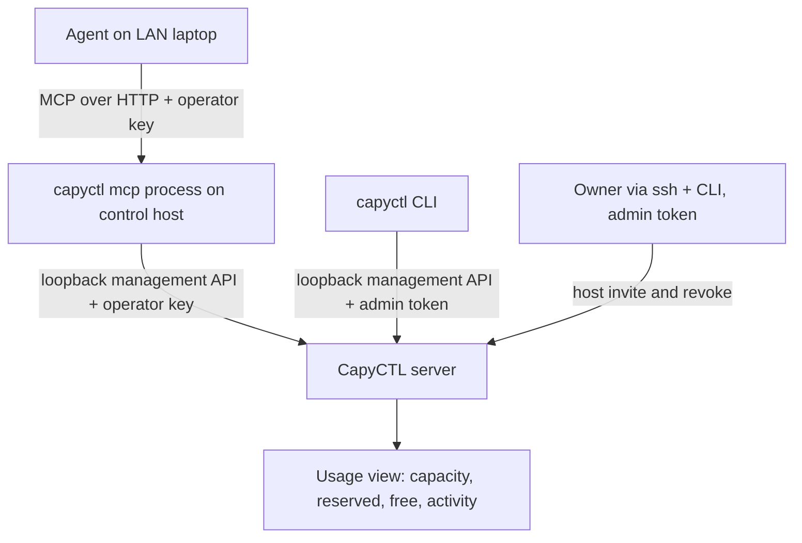
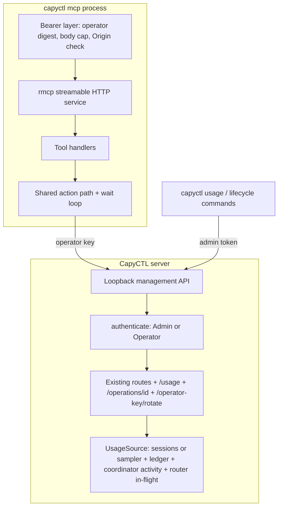

# MCP Server for Agents - Plan

## Goal Capsule

- **Objective:** An AI agent on the owner's network can connect to CapyCTL over MCP, see what is running and how loaded each host is, and operate deployments, using the same answers the CLI gives.
- **Means:** A new remote-operator credential enforced by the management API (U2), an operation read route (U3), a usage view shared by the CLI and MCP (U4, U5), and a `capyctl mcp` process that serves MCP over HTTP and calls the loopback management API (U6-U8).
- **Product authority:** `docs/SPEC.md` first, then the ADRs in `docs/design/adr/`, then this plan. Network-reachable management commands amend ADR 0019 §10 and SPEC §13.3, so ADR 0023 (U1) is recorded before any code lands. Execution status belongs only in `docs/runbooks/f2-current-status.md`.
- **Execution:** Implement in unit order on a branch off `main`, one commit per unit, and open a PR against `main`. Never push to `main` and never publish a release.
- **Stop conditions:** Stop and report if the owner rejects ADR 0023, if `rmcp` cannot be added under `--locked` builds, or if a unit would require weakening a SPEC §13.3 protection.
- **Open blockers:** None.

---

## Product Contract

### Summary

Add a `capyctl mcp` command that runs an MCP server as its own process on the control host, serving MCP over HTTP to agents on the network behind a new remote-operator key.
The process talks to CapyCTL only through the existing loopback management API and mirrors the operator part of that API as MCP tools.
Add one new management API usage view, shown by a CLI command and mirrored by MCP, that answers what is running, how loaded each host is, and what could be freed.

### Problem Frame

CapyCTL is operated today through the CLI on the control host, or by `ssh` plus the CLI from elsewhere (ADR 0019 §10).
MCP-capable agents, such as coding assistants and desktop chat apps, increasingly run on the owner's laptop, not on the control host, and have no supported way to reach CapyCTL.
The owner's first questions for such an agent are operational: what is running, what is the load on a given host, and what can be freed.
Those answers exist only as raw pieces today: host domain capacity in the hosts view, per-deployment reservations in the ledger snapshot, and request histograms in the latency metrics.
A human or an agent has to join them by hand, so the same question is hard to answer from the CLI as well.

### Architecture at a glance

The management listener stays on loopback.
Only the `capyctl mcp` process is network-reachable, and only while it runs.

### Key Decisions

- **HTTP transport for agents on other machines.** Agents usually run on a different machine from the control host, so MCP is served over HTTP rather than only over local stdio or an SSH tunnel. (session-settled: user-directed — chosen over loopback-only HTTP reached through an SSH or Tailscale tunnel: agents and a future web app should connect directly.)
- **A third credential: the remote-operator key.** The key is distinct from the inference API key and the loopback admin token. This keeps SPEC §13.3's rule that remote control and ingress use distinct identities, and lets the admin token stay the root of trust. (session-settled: user-approved — chosen over reusing the admin token on a network bind or using the inference key: one leaked secret would otherwise grant root control or let any inference client operate the fleet.)
- **The operator key is a full deployment operator, not an administrator.** It covers every operator action, while host invitation and host revoke stay on loopback with the admin token. (session-settled: user-approved — chosen over full parity and over remote revoke-only: a network key able to enroll hosts could add a rogue machine that then receives workloads.)
- **`capyctl mcp` is its own process.** It runs in the foreground by default, with a flag to run in the background, and talks to the loopback management API. Nothing is exposed unless it is running. (session-settled: user-directed — chosen over a persistent enable switch inside the server: the server and its loopback rule stay unchanged, and MCP cannot destabilize the control plane.)
- **Mirror the management API rather than design agent-specific views.** MCP tools map closely to management API operations, so MCP stays a thin layer in lockstep with the API. (session-settled: user-directed — chosen over curated agent-only operator views and over a server-side advisor that plans what to free: questions worth asking an agent are also worth asking the CLI, so their answers belong in the API.)
- **The usage answer is computed once, in the management API.** A new usage view joins capacity, reservations and request activity, and the CLI and MCP both present it. (session-settled: user-approved — chosen over leaving agents to derive it from raw routes: every client gets the same numbers.)
- **Action tools wait for the outcome up to a deadline.** On timeout they report that the operation is still in progress and how to resume waiting. (session-settled: user-approved — chosen over returning immediately and over streaming progress notifications: agents tend to treat a returned call as done, and notification support varies across clients.)

### Actors

- A1. Owner: runs `capyctl mcp`, holds the operator key, configures the agent client, and keeps admin-only actions on the control host.
- A2. Agent: an MCP client on the owner's network, usually on another machine, acting with the operator key.
- A3. CLI user: asks the same usage questions from a terminal through the new CLI command.
- A4. CapyCTL server: the only authority on state; it computes the usage view, executes actions, and enforces the operator role.

### Requirements

**Process and lifecycle**

- R1. `capyctl mcp` runs the MCP server in the foreground until stopped.
- R2. A flag runs the same server in the background, with a supported way to stop it and to check whether it is running.
- R3. The MCP process reaches CapyCTL only through the loopback management API and never through engine listeners or the inference router.
- R4. When `capyctl mcp` is not running, no MCP or remote management surface is reachable.
- R5. `capyctl mcp` runs on the control host in both the server and standalone roles.

**Access and credentials**

- R6. Every MCP request must present the remote-operator key, and a request without a valid key is refused before any tool runs.
- R7. The operator key is distinct from the inference API key and the admin token, and the inference key never authorizes an MCP request.
- R8. CapyCTL creates the operator key automatically and stores it owner-only, and `capyctl mcp config` prints it on request together with a ready-to-paste client configuration.
- R9. The operator key persists across runs, so a configured client keeps working after a restart.
- R10. The owner can rotate the operator key from the control host, and rotation invalidates the old key without restarting the server.
- R11. The key is never logged, never returned by a tool, and never included in management responses.
- R12. The MCP listener may bind to a non-loopback address. CapyCTL does not terminate TLS for it, matching the inference endpoint's reverse-proxy guidance.

**Tool surface**

- R13. MCP exposes the management API's operator read views (snapshot, deployments, deployment detail, effective config, hosts, engines list, model sources, latency metrics, inference listener, installation, operations, recent events) and the new usage view.
- R14. MCP exposes every lifecycle action the management API accepts (start, stop, park, preinitialize, delete) at the deployment and the instance level, plus deploy, deployment update and host drain.
- R15. Host invitation and host revoke are not reachable through MCP under any configuration, and the server refuses them for the operator key.
- R16. Read tools that can return large results accept a filter by host and by deployment, so an agent can ask about one host without receiving the whole ledger.
- R17. Each tool describes its effect clearly enough for an MCP client to flag destructive or disruptive calls (delete, stop, drain) to its user.
- R18. Tool results carry the same identifiers, states and error codes as the management API, so an agent's answer can be checked against the CLI.

**Action semantics**

- R19. Action tools keep the management API's guarantees: an idempotency key, the expected revision, and durable acceptance before the call returns.
- R20. An action tool waits until the operation reaches a terminal outcome or the caller's deadline, whichever comes first.
- R21. On deadline expiry, the tool reports that the operation is still in progress, with its operation identifier, and a wait tool resumes waiting on it.
- R22. Waiting never retries or replays an action. A repeated call with the same idempotency key returns the original operation.

**Usage view**

- R23. The management API offers a usage view that reports, per host memory domain, capacity, reserved and free bytes.
- R24. The usage view reports, per deployment and instance, the host and domains it occupies, the bytes it holds in each, its lifecycle state, and its recent request activity.
- R25. Recent request activity distinguishes deployments serving requests now from ones idle for a stated period, not only lifetime totals.
- R26. When a figure is unknown or stale, the view says so rather than reporting a number.
- R27. A CLI command shows the usage view as text by default and as JSON on request, per ADR 0021.

**Governance**

- R28. A new ADR records these owner decisions and amends the relevant text of ADR 0019 §10 and SPEC §13.3.
- R29. Operator docs cover starting `capyctl mcp`, connecting a client, key rotation, and exposure guidance next to `docs/operations/network-access.md`.
- R30. Tests are tagged with their acceptance-matrix IDs, and the security tests extend T37's boundaries to the MCP listener.

### Key Flows

- F1. First connection
  - **Trigger:** The owner wants an agent on a laptop to manage CapyCTL.
  - **Actors:** A1, A2
  - **Steps:** The owner runs `capyctl mcp config` on the control host and pastes the printed snippet into the agent's MCP configuration. The owner runs `capyctl mcp` (or `capyctl mcp --background`). The agent lists tools and calls one.
  - **Outcome:** The agent is connected, and the key keeps working across restarts.
  - **Covered by:** R1, R2, R6, R8, R9

- F2. "What is running, how loaded is host B, what can go"
  - **Trigger:** The owner asks the agent the question.
  - **Actors:** A1, A2, A4
  - **Steps:** The agent calls the usage tool filtered to host B. It reports free and reserved memory per domain, which deployments hold it, and which of them are idle. It then proposes parking or stopping the idle ones.
  - **Outcome:** The owner sees the same numbers `capyctl usage` would print, and decides.
  - **Covered by:** R13, R16, R23, R24, R25, R27

- F3. Acting with a deadline
  - **Trigger:** The owner approves parking a deployment.
  - **Actors:** A2, A4
  - **Steps:** The agent calls the park tool with a wait limit. The tool waits for the outcome. If the limit passes, the agent receives the operation identifier and calls the wait tool.
  - **Outcome:** The agent reports a confirmed end state, never "probably done".
  - **Covered by:** R19, R20, R21, R22

### Acceptance Examples

- AE1. **Covers R6, R7.** **Given** `capyctl mcp` is running, **when** a client calls a tool with the inference API key, **then** the request is refused and no tool runs.
- AE2. **Covers R15.** **Given** an agent holds a valid operator key, **when** it looks for host invitation or host revoke, **then** no such tool exists, and a direct management call with the operator key to either route is refused.
- AE3. **Covers R20, R21.** **Given** a wake that takes longer than the caller's wait limit, **when** the limit passes, **then** the tool returns "in progress" with the operation identifier, and a later wait call returns the final outcome.
- AE4. **Covers R22.** **Given** an action tool call that timed out on the client side, **when** the agent repeats it with the same idempotency key, **then** CapyCTL returns the original operation and starts no second action.
- AE5. **Covers R4.** **Given** `capyctl mcp` was stopped, **when** a client connects to its former address, **then** the connection fails, and the management listener is still loopback-only.
- AE6. **Covers R25, R26.** **Given** a host that has not reported memory recently, **when** the usage view is read, **then** that host's figures are marked stale rather than shown as current.
- AE7. **Covers R18, R27.** **Given** the same moment, **when** the owner runs `capyctl usage` and the agent calls the usage tool, **then** both report the same capacity, reserved and free figures.
- AE8. **Covers R10.** **Given** a running server and MCP process, **when** the owner runs `capyctl mcp rotate-key`, **then** requests with the old key are refused at once and the new key works after the MCP process restarts.

### Success Criteria

- The owner's opening script works end to end from a LAN laptop: the agent answers what is running, the load on a named host, and what could be freed, and the figures match the CLI.
- A security review finds no MCP path to host enrollment, revoke, engine control, prompts or secrets.
- CPU and Fake-engine tests are not qualification. Live verification on the lab hosts is still required before any status claim about real engines.

### Scope Boundaries

- Host invitation, host revoke and engine registration stay on the control host with the admin token. Engine registration is a local CLI action, not a management API route.
- No server-side advisor that plans "free N GiB on host B". The usage view is its foundation and makes it a small later step.
- No TLS termination. Exposure beyond the LAN goes through a reverse proxy or a tailnet, as for the inference endpoint.
- No systemd unit or reboot persistence for background mode.
- No key-less local stdio mode.
- No web app. It is expected to reuse the operator key and this access model later.
- No scoped or per-client operator keys. There is one key, rotatable.
- No inference through MCP. Prompts and completions stay on the inference endpoint.
- No suspend or resume tools. The management API refuses both actions today.

### Dependencies / Assumptions

- The management API is the single source for every tool, so MCP inherits its idempotency, revision checks and error codes.
- Host capacity is live, not durable: the server role reads it from agent sessions (`crates/capyctl-controller/src/agent_sessions.rs`, `DomainView.capacity_bytes`, `available_bytes`, `observed_at_unix_ms`) and standalone from its domain sampler (`crates/capyctl-management/src/hosts.rs`, `StandaloneHost.domains`).
- Request recency already exists inside the coordinator (`note_activity` in `crates/capyctl-controller/src/coordinator/worker.rs`, `last_activity` in `crates/capyctl-controller/src/coordinator/switching.rs`) and in-flight counts in the router (`InFlight` in `crates/capyctl-router/src/admission.rs`). Neither is exposed by any API today.
- The events stream is optional (mounted only when events are enabled), so waiting polls operation state instead.
- The MCP process is the same `capyctl` binary as the CLI, so it shares the server's release on the control host. It still checks the API version it receives (ADR 0017).

---

## Planning Contract

### Key Technical Decisions

- KTD1. **The server enforces the operator role.** `ManagementCredentials` grows from one digest to a set of `(digest, Role)` pairs with `Role::Admin` and `Role::Operator`. The authentication layer records the matched role in the request, and routes that require `Admin` (host invitation, host revoke, operator-key rotation) refuse `Operator` with 403 `operator_not_permitted`. The MCP process calls the loopback API with the operator key and never holds the admin token. This resolves the brainstorm's open credential question in favor of server-side enforcement, so R15 holds even if the MCP process is bypassed.
- KTD2. **The operator key is a separate owner-only file, created by the server.** On start, both roles create `<state>/identity/operator-key` (mode 0600, private 0700 directory, same `IdentityDirectory` rules as today's bundles) when it is missing, using the existing token generator. Existing installs get a key on their first start after upgrade. The file is separate from `server-credentials.json` and the standalone `credentials` file, so their formats and versions do not change. The three tokens must be pairwise distinct; start refuses otherwise (`MissingCredentials`-style failure, never a fallback).
- KTD3. **Rotation is an admin-only management route.** `POST /management/v1/operator-key/rotate` (admin token, loopback) generates a new key, writes it atomically, and swaps the operator digest in memory. `capyctl mcp rotate-key` calls it with the admin token, then restarts a background MCP process if one is running. The digest set lives behind a lock the authentication layer reads per request.
- KTD4. **MCP lives in `capyctl-cli` as an `mcp` module, built on `rmcp`.** Putting it in the CLI crate reuses `local_role::resolve`, the management client, the client journal, and the output conventions without a new crate boundary. `rmcp` (official Rust SDK, 3.5.x, features `server`, `macros`, `transport-streamable-http-server`) provides the protocol and the streamable HTTP transport as a tower service mounted in an axum router. It is added to `Cargo.lock` so `--locked` and the site's `--offline` CLI-reference build keep working.
- KTD5. **The MCP router authenticates before `rmcp` sees a request.** An axum layer checks the bearer token against the operator digest in constant time (same `subtle` comparison as `ManagementCredentials::accepts`) and returns 401 without invoking the service. The layer also enforces a request body cap, a concurrency limit, and `no-store`. The `Origin` header is validated when present, per the MCP transport's DNS-rebinding guidance.
- KTD6. **Action tools reuse the CLI's action path.** The CLI's `Management` client already resolves a deployment name to its ULID, reads the current revision, computes the lifecycle deadline from the deployment's windows, journals the mutation, and sends the idempotency key (`crates/capyctl-cli/src/client.rs`). U7 factors that path into a function both the CLI and MCP call. An MCP action tool accepts an optional `expected_revision` (default: the revision read just before submission, as the CLI does) and an optional `idempotency_key` (default: a new ULID, returned in the result so the agent can repeat the call safely).
- KTD7. **Waiting polls a new operation route.** U3 adds `GET /management/v1/operations/{id}`, backed by the existing `Store::get_management_operation`. The wait loop polls it with capped backoff (250 ms rising to 2 s) until a terminal state (`succeeded`, `failed`, `cancelled`) or the caller's `wait_seconds` (default 120, maximum 900). Instance actions whose response has no `operation_id` wait on the instance's `latest_operation` from deployment detail instead. Waiting never resubmits.
- KTD8. **The usage view is a `UsageSource` wired per role, like `LatencySource`.** `GET /management/v1/usage?host=&deployment=` joins three inputs: live domain capacity and availability (agent sessions or the standalone sampler), reserved bytes per domain from the ledger (`resource_snapshot()` owners mapped to hosts through `host_resource_keys`), and activity from the coordinator (`last_activity`, converted to `idle_ms` against the coordinator clock at read time) plus router in-flight and queued counts. Per domain it reports `capacity_bytes`, `available_bytes` (observed), `reserved_bytes` (CapyCTL ledger), `unreserved_bytes` (`capacity - reserved`, floored at 0), and `observed_at_ms` with a `stale` flag. A domain is stale when its observation is older than the session freshness bound already used for host publication; stale or missing figures are emitted as `null` with a reason, never as zero. Byte values are decimal strings, as elsewhere in the API.
- KTD9. **Tools mirror routes one to one, with explicit names and annotations.** Read tools: `get_usage`, `get_snapshot`, `list_deployments`, `get_deployment`, `get_effective_config`, `list_hosts`, `list_engines`, `list_model_sources`, `get_latency`, `get_inference_listener`, `get_installation`, `get_operation`, `recent_events`. Action tools: `deploy`, `update_deployment`, `start_deployment`, `stop_deployment`, `park_deployment`, `preinitialize_deployment`, `delete_deployment`, `instance_action`, `drain_host`, `wait_operation`. Reads carry `readOnlyHint`; delete, stop and drain carry `destructiveHint`; actions carry `idempotentHint` because of the idempotency key. Results return the management API's JSON unchanged inside the tool result, plus an error mapping that keeps the API's `error_code`.
- KTD10. **Large reads are filtered and bounded.** `get_snapshot` takes `host` and `deployment` filters applied in the MCP process to the snapshot's deployments, instances, reservations and operations, and omits ledger internals (claims, bindings, grants, steps) unless `include_ledger` is set. Every tool result is capped at 1 MiB; a capped result says so and names the filter to narrow it. `recent_events` reads the SSE stream from a cursor for at most 2 s or 200 events, then closes, and returns the next cursor.
- KTD11. **`capyctl mcp` command shape.** `capyctl mcp` (foreground), `capyctl mcp --background`, `capyctl mcp stop`, `capyctl mcp status`, `capyctl mcp config`, `capyctl mcp rotate-key`. `--listen ADDR` defaults to `0.0.0.0:7444`, because running the command is the opt-in and the key is mandatory; `--listen 127.0.0.1:7444` keeps it local. On a non-loopback bind the process prints, once at start, that the endpoint is plain HTTP and how to put a TLS proxy in front. Background mode re-executes the binary detached, writes `<state>/mcp/mcp.pid` and logs to `<state>/mcp/mcp.log` (owner-only). `stop` verifies through `/proc/<pid>/cmdline` that the pid is a `capyctl mcp` process before signalling it. Environment overrides follow existing naming: `CAPYCTL_MCP_LISTEN`.
- KTD12. **The key never leaves the process except through `capyctl mcp config`.** The process holds the key in memory, never logs it, and redacts the `authorization` header in any request log. `config` prints the URL, the key, and a snippet in the common `mcpServers` JSON shape with a bearer header. The foreground start banner prints the URL and points to `capyctl mcp config`, without the key.

### High-Level Technical Design

### Sequencing

U1 first, because the ADR gates every other unit.
U2 and U3 are independent server changes and can land in either order.
U4 depends on nothing but U1; U5 depends on U4.
U6 depends on U2. U7 depends on U3 and U6. U8 depends on U6.
U9 and U10 close the work.

---

## Implementation Units

### U1. ADR 0023 and SPEC amendments

- **Goal:** Record the owner decisions before code lands (R28).
- **Files:**
  - Create `docs/design/adr/0023-mcp-remote-operator.md` with the ADR 0021 skeleton: `# ADR 0023 — Remote operator access over MCP`, `**Status:** Accepted (owner decision, 2026-10-01).`, `## Context`, `## Decision` (numbered sections for the operator role, the separate process, the listener, rotation, the usage view, and what stays admin-only), `## Consequences`.
  - Modify `docs/SPEC.md` §13.3: add an "Amended by ADR 0023" paragraph after the ADR 0019 one. It says the management listener keeps its loopback rule, an operator credential distinct from the admin token and inference key may reach operator routes through `capyctl mcp`, and host invitation, revoke and key rotation stay admin-only.
  - Modify `docs/SPEC.md` §20: extend T37 with "operator key refused on admin routes; MCP listener requires the operator key; inference key refused by MCP (ADR 0023)". Add T41 "Remote operator over MCP": usage figures match the CLI, action tools wait with a deadline, repeated idempotency keys do not replay.
  - Modify `docs/SPEC.md` §21: add a 2026-10-01 ADR 0023 entry listing the touched sections and T37, T41.
  - Modify `docs/design/adr/0019-discrete-gpu-and-network-endpoint.md` §10: add one line, "Amended by ADR 0023: remote operator access through `capyctl mcp`."
  - Modify `AGENTS.md`: add ADR 0023 to the ADR list sentence.
- **Patterns:** `docs/design/adr/0021-terminal-output.md`; the ADR 0019 amendment paragraph in SPEC §13.3; the §21 ADR 0019 entry.
- **Test scenarios:** None (documentation). The site's link checks run in U10.
- **Verification:** `rg -n "ADR 0023" docs/SPEC.md AGENTS.md docs/design/adr` shows each reference; owner sign-off on the ADR text is the gate for U2 onward.

### U2. Operator role and operator key

- **Goal:** A third credential the server accepts for operator routes only, created automatically and rotatable without a restart (R6-R11, R15).
- **Files:**
  - Modify `crates/capyctl-management/src/lib.rs`: `ManagementCredentials` holds `RwLock<Vec<(Digest, Role)>>`; `accepts()` becomes `role_for(&HeaderValue) -> Option<Role>`; `authenticate` inserts the `Role` into request extensions. Add a `require_admin` layer. Keep the constant-time comparison and compare against every stored digest so timing does not reveal which role matched.
  - Modify `crates/capyctl-management/src/enrollment.rs`: wrap host invitation and host revoke in `require_admin`.
  - Create `crates/capyctl-management/src/operator_key.rs`: `POST /operator-key/rotate` (admin only) that generates, writes atomically (temp file plus rename in the private directory), and swaps the operator digest. Response is `{api_version, rotated_at_ms}`, never the key.
  - Modify `crates/capyctl-cli/src/remote_roles.rs` (server init and start) and `crates/capyctl-cli/src/roles.rs` (standalone): create `identity/operator-key` when missing, load it, check pairwise distinctness with the admin token and inference key, pass it into `ManagementCredentials`, and mount the rotate router.
  - Modify `crates/capyctl-management/src/credentials.rs`: accept the operator key file in the protected-file reader.
- **Patterns:** token generation `remote_roles.rs` `token()`; `IdentityDirectory` and `private_read` in `remote_roles.rs`; `from_trusted_resolver` distinctness check in `lib.rs`.
- **Test scenarios** (tag `// T37`):
  - Operator key reads snapshot and submits a park; admin token does the same.
  - Operator key on `POST /host-invitations` and `POST /hosts/{id}/revoke` returns 403 `operator_not_permitted` and records nothing.
  - Inference key on any management route returns 401.
  - Equal operator and admin tokens refuse to construct credentials.
  - Rotate with the admin token: the old operator key is refused on the next request and the new file content is accepted. Rotate with the operator key returns 403.
  - Start with no operator-key file creates one with mode 0600; a group-writable file is refused.
  - The key never appears in any response body or in logs captured during the tests.
- **Verification:** `cargo test -p capyctl-management -p capyctl-cli --all-targets --locked`.

### U3. Operation read route

- **Goal:** Let any client read one operation's state without fetching the whole snapshot (R13, R20-R22).
- **Files:**
  - Create `crates/capyctl-management/src/operations.rs`: `GET /operations/{id}` returning `{api_version, id, deployment_id, action, state, error_code, reason, accepted_at_ms, finished_at_ms}` from `Store::get_management_operation` (`crates/capyctl-store/src/resource_policy.rs`). Invalid id is 400, unknown id is 404.
  - Modify `crates/capyctl-management/src/lib.rs` `routes()`: mount it with the actions routes, available to both roles.
- **Patterns:** `actions.rs` id validation and error bodies; `snapshot.operations` field names so the CLI and this route agree.
- **Test scenarios:** accepted, succeeded, failed and cancelled operations read back with the same state the snapshot shows; malformed and unknown ids; operator and admin both allowed.
- **Verification:** `cargo test -p capyctl-management --all-targets --locked`.

### U4. Usage view in the management API

- **Goal:** One computed answer for capacity, reservation and activity per host and deployment (R23-R26).
- **Files:**
  - Modify `crates/capyctl-controller/src/coordinator/switching.rs`: add `activity_snapshot() -> Vec<(deployment, generation, last_ms)>` and expose the coordinator clock's `now` to the view, read-only.
  - Modify `crates/capyctl-router/src/admission.rs` and `crates/capyctl-router/src/queue.rs`: add a read-only per-deployment `in_flight` and `waiting` snapshot.
  - Create `crates/capyctl-management/src/usage.rs`: `UsageSource` trait, `usage_router`, the join described in KTD8, and the `host` and `deployment` query filters (bounded like `metrics.rs` `deployment_filter`).
  - Modify `crates/capyctl-cli/src/remote_roles.rs` and `crates/capyctl-cli/src/roles.rs`: build the per-role `UsageSource` (server: `AgentSessions::inspect`; standalone: `StandaloneHost.domains`) and mount the router next to the latency router.
- **Patterns:** `metrics.rs` `LatencySource` and `latency_router`; `hosts.rs` session and sampler readers; `resource_ledger.rs` `resource_snapshot()` and `host_resource_keys`; `snapshot.rs` `ReservationSnapshot` for owner-to-instance mapping.
- **Test scenarios** (tag `// T41`):
  - Two deployments on one host: per-domain reserved equals the sum of their allocations, and unreserved equals capacity minus reserved.
  - Reservations larger than capacity floor unreserved at zero and keep reserved exact.
  - An observation older than the freshness bound yields `stale: true` and null figures with a reason.
  - A deployment with recent activity reports `idle_ms` near zero; one with none reports `idle_ms: null` and `activity: "none_recorded"`.
  - `host` and `deployment` filters narrow output; an invalid filter is 400.
  - Discrete-GPU fixture: device domains and the system domain are reported separately (ADR 0019).
- **Verification:** `cargo test -p capyctl-management -p capyctl-controller -p capyctl-router --all-targets --locked`.

### U5. `capyctl usage` command

- **Goal:** The CLI answers the same question from the same view (R27, AE7).
- **Files:**
  - Modify `crates/capyctl-cli/src/grammar.rs`: add `usage` with `--host` and `--deployment`, and help text that cites no SPEC, ADR or section numbers.
  - Modify `crates/capyctl-cli/src/main.rs`: dispatch through the management client and `emit()`.
  - Modify `crates/capyctl-cli/src/table.rs`: a `View::Usage` with a per-host table (domain, capacity, reserved, unreserved, observed free, age) and a per-deployment table (deployment, instance, host, held, state, in flight, idle), using `gib()`, `seconds()` and `host_label()`.
  - Modify `crates/capyctl-cli/examples/cli_reference.rs` only if the generator needs a hint; the reference page regenerates from clap.
- **Patterns:** `capyctl status` and `capyctl list deployments` in `table.rs` and `views.rs`; JSON passes the API body through unchanged.
- **Test scenarios:** text and JSON output against a fake management server (`tests/management_cli.rs` pattern); stale domains render as "stale" rather than numbers; `cli_reference` and `wording_gate` tests pass with the new command.
- **Verification:** `cargo test -p capyctl-cli --all-targets --locked`.

### U6. MCP server core and read tools

- **Goal:** An authenticated MCP endpoint with every read tool (R3, R6, R7, R11-R13, R16-R18).
- **Files:**
  - Modify `Cargo.toml` (workspace dependency `rmcp` with the KTD4 features) and `crates/capyctl-cli/Cargo.toml`; update `Cargo.lock`.
  - Create `crates/capyctl-cli/src/mcp/mod.rs`: build the axum router with the KTD5 layer and the `rmcp` streamable HTTP service at `/mcp`; reject every other path with 404.
  - Create `crates/capyctl-cli/src/mcp/auth.rs`: operator-digest check, body cap (1 MiB), concurrency limit (16), Origin check, header redaction.
  - Create `crates/capyctl-cli/src/mcp/read_tools.rs`: the read tools in KTD9, each one call to the loopback API through `remote_roles::management_call` with the operator key, plus the KTD10 filters and result cap.
  - Create `crates/capyctl-cli/src/mcp/errors.rs`: map management refusals (`client::refusal`) to MCP tool errors carrying `error_code` and the message.
- **Patterns:** `remote_roles::management_call`; `local_role::resolve` for the endpoint; the axum test server pattern in `crates/capyctl-management/tests/http.rs`.
- **Test scenarios** (tag `// T37` for security, `// T41` for behavior), using an in-process fake management API and an `rmcp` client:
  - No bearer, a wrong bearer, the inference key and the admin token all get 401 before any tool runs (the admin token is not the MCP credential).
  - `tools/list` returns exactly the KTD9 set, with annotations, and contains nothing for invitation, revoke or engine registration.
  - `get_usage` with `host` returns the fake API body unchanged.
  - `get_snapshot` with a `deployment` filter drops other deployments and omits ledger internals.
  - An oversized result is capped with a note naming the filter.
  - A bad `Origin` is refused.
- **Verification:** `cargo test -p capyctl-cli --all-targets --locked`; `cargo clippy -p capyctl-cli --all-targets --locked -- -D warnings`.

### U7. Action tools and waiting

- **Goal:** Every operator action with wait-with-deadline and safe repetition (R14, R17, R19-R22).
- **Files:**
  - Modify `crates/capyctl-cli/src/client.rs`: extract the submit path (name to id, revision read, lifecycle deadline, journal, idempotency key) into `submit_action(target, deployment, instance, action, options) -> Receipt`, used by the CLI unchanged in behavior.
  - Create `crates/capyctl-cli/src/mcp/action_tools.rs`: the action tools in KTD9; `deploy` posts `{config, activate}` with the same config parsing the CLI uses for `capyctl deploy`; `update_deployment` puts `{config, expected_revision}`; `drain_host` posts the drain with an idempotency key.
  - Create `crates/capyctl-cli/src/mcp/wait.rs`: the KTD7 wait loop and the `wait_operation` tool.
  - The MCP client journal lives under `<state>/mcp/journal`, separate from the CLI's.
- **Patterns:** `client.rs` lifecycle submission and `wait`; `client/delete.rs`; `drain.rs` in the CLI.
- **Test scenarios** (tag `// T41`):
  - Park completes within the wait limit and returns the terminal operation.
  - A slow operation returns `in_progress` with `operation_id`; `wait_operation` then returns the final state.
  - Repeating a call with the same `idempotency_key` returns the original `operation_id` and the fake API records one submission.
  - A stale `expected_revision` surfaces the API's revision conflict code unchanged.
  - Delete and stop tool descriptions and annotations mark them destructive.
  - The CLI's existing lifecycle tests pass unchanged after the extraction.
- **Verification:** `cargo test -p capyctl-cli --all-targets --locked`.

### U8. `capyctl mcp` command lifecycle

- **Goal:** Start, background, stop, status, config and rotation from the CLI (R1, R2, R4, R5, R8-R10, R12).
- **Files:**
  - Modify `crates/capyctl-cli/src/grammar.rs`: the `mcp` subcommands and `--listen` from KTD11.
  - Create `crates/capyctl-cli/src/mcp/process.rs`: foreground serve with graceful shutdown on SIGINT and SIGTERM; `--background` re-exec, pidfile and log file; `stop` with the `/proc` cmdline check; `status` reporting pid, listen address and whether the endpoint answers.
  - Create `crates/capyctl-cli/src/mcp/config.rs`: `config` output (URL, key, client snippet) and `rotate-key` (calls U2's route with the admin token, then restarts a running background process).
  - Modify `crates/capyctl-cli/src/main.rs`: dispatch, with ADR 0021 text and JSON output for `status` and `config`.
- **Patterns:** `tests/support/process.rs` `Guarded::spawn` for tests; the non-loopback warning wording for the inference listener (ADR 0019).
- **Test scenarios:**
  - Foreground start on a free port answers `initialize`; SIGTERM stops it and the port closes (AE5).
  - `--background` writes the pidfile, `status` reports it running, `stop` ends it and removes the pidfile.
  - `stop` refuses a pidfile that points at a non-`capyctl mcp` process.
  - A non-loopback `--listen` prints the plain-HTTP notice once; a loopback one prints nothing.
  - `config` prints a snippet whose key authenticates against the running process; the background log never contains the key.
  - `rotate-key` against a running server and background MCP process makes the old key fail and the new key work (AE8).
  - Standalone and server roles both resolve the endpoint and key (R5).
- **Verification:** `cargo test -p capyctl-cli --all-targets --locked`.

### U9. Documentation and status

- **Goal:** Operators can set it up from the docs alone (R29).
- **Files:**
  - Create `docs/operations/agents-mcp.md`: what it is, `capyctl mcp config`, connecting a client, background mode, rotation, exposure guidance (LAN, tailnet, TLS proxy), and the tool list.
  - Modify `docs/operations/network-access.md`: a short section linking to it and restating that management stays loopback.
  - Modify `docs/operations/configuration.md`: `CAPYCTL_MCP_LISTEN` and the operator-key file.
  - Create `docs/guide/agents.md` and add it to the site's synced pages (`site/scripts/pages.mjs`), so `check-commands.mjs` validates the commands it shows.
  - Modify `docs/runbooks/f2-current-status.md`: one entry with the commit range, test totals, and the statement that CPU and Fake-engine tests are not qualification.
- **Patterns:** `docs/operations/network-access.md` tone and structure; existing guide pages.
- **Test scenarios:** site checks in U10.
- **Verification:** `(cd site && npm run check)`.

### U10. Verification and live smoke

- **Goal:** Prove the change with the repo's gates, then once on real hardware.
- **Files:** none.
- **Steps:** run the Verification Contract. Then, on a maintainer's local machine in standalone mode (authorized by AGENTS.md), start `capyctl mcp`, connect a real MCP client from a second machine on the LAN, and run the owner's script: what is running, the usage of the host, and park an idle deployment with a wait. Record the result in the status runbook.
- **Verification:** all commands below pass; the live smoke matches `capyctl usage` output.

---

## Verification Contract

| Check | Command | Applies to |
|---|---|---|
| Format | `cargo fmt --all --check` | All units |
| Lint | `cargo clippy --workspace --all-targets --locked -- -D warnings` | All code units |
| Core suite | `cargo test -p capyctl-adapters -p capyctl-store -p capyctl-controller -p capyctl-management -p harness --all-targets --no-fail-fast --locked -- --test-threads=4` | U2-U4 |
| Workspace | `cargo test --workspace --all-targets --locked` | All code units |
| Packaging | `scripts/verify-packaging.sh` | U6 (new dependency), U8 |
| Installer | `scripts/test-install.sh` | U2 (credential files at install) |
| Site | `(cd site && npm run check)` | U5, U9 |
| Coverage | `rg -n "// T37|// T41" crates` lists the new tests | U2-U8 |

## Definition of Done

- ADR 0023 is accepted and SPEC §13.3, §20 and §21 reference it.
- Every requirement R1-R30 maps to a unit above, and every acceptance example AE1-AE8 has a test.
- All Verification Contract checks pass locally, with the commands and totals recorded in the status runbook.
- The live smoke from a second LAN machine answers the owner's script, and the runbook states that CPU and Fake-engine tests are not qualification.
- The work is on a branch with a PR against `main`; nothing is pushed to `main` and no release is published.
