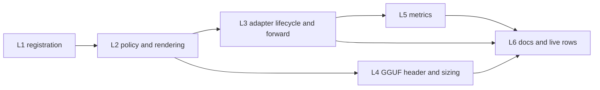

# llama.cpp Engine Implementation Plan

**Goal:** CapyCTL registers a `llama-server` binary (llama.cpp 0.6.0) with
`capyctl engine add`, deploys one GGUF model per deployment, routes, drains,
stops-to-park and relaunches-to-wake it on hosts and in standalone alike, reports its
per-request figures and load, and passes live rows LC1–LC6 on a maintainer's
discrete-GPU machine (and on GB10 once the owner approves a lab-host build).

**Architecture:** `llamacpp` becomes the fourth variant of every closed engine set.
Registration gains a bare-binary source beside the dist-info one. Resolution makes
every llama.cpp deployment `restart_only`, requires `context_length`, takes the slot
count from `max_concurrent_requests` (default 4), validates a small typed block
(`engine_config.llamacpp`) and an exact-name option policy, and derives the memory
request from the GGUF header when the deployment states none. A new adapter module,
`capyctl-adapters::llamacpp`, mirrors `tensorfold/`: one builder renders the command
and the closed environment for the host agent and the embedded coordinator, readiness
reads `/health`, `/v1/models` and `/props`, and the idle gate reads `/metrics`.

**Spec:** `docs/specs/2026-10-09-llamacpp-engine-design.md` and ADR 0029. Governing:
`docs/SPEC.md` §1, §6.2–§6.5, §7, §8.1–§8.2, §9.4, §10, §12, §13.3, §17, §20; ADR 0008,
0012, 0014 (§3, §5, §6, §7, §8, A1, A6, A7, A18), 0017, 0018, 0019, 0023, 0024;
`AGENTS.md`.

## Rulings (made while planning)

1. **T42.** SPEC §20 gains "T42 llama.cpp conformance" in slice L1, with the first
   tests that carry it: detection executes nothing, `engine add` reads the version
   from standard error and refuses a machine with `/etc/llama.cpp/config.ini`, launch
   arguments and reserved options (every alias, negative form and `_` spelling), the
   KV layout, readiness and the rendered-value check, the `/metrics` idle gate,
   `restart_only` park and wake, `deep` refused, `cache_salt` refused, a draft model
   outside the approved paths refused, `local_engine.llamacpp` three ways.
2. **The verified pin lands last.** `(llamacpp, "0.6.0")` is added to `VERIFIED` in
   L6, after LC1–LC6 pass; until then every build lists as `custom`. The listing rule
   (`0.6.0-dev` with commit `d812350` reads as 0.6.0) lands in L1 with a test that
   uses a test-only verified table.
3. **One source for the slot count.** `--parallel` is reserved in every argument list
   (TensorFold lets it win; here it sizes the KV). `max_concurrent_requests` is the
   only source, 4 when undeclared (`LLAMACPP_DEFAULT_PARALLEL`); status shows it under
   `context.streams` with source `declared` or `default`.
4. **Exact-name matching.** llama.cpp has its own matcher in `engine_policy.rs`:
   `_` → `-` in `--` names, then exact comparison against every alias and negative
   form. TensorFold's prefix rule is not reused (it would flag `--cache-reuse`).
   `--name=value` is refused at deploy time with a message saying llama.cpp rejects it.
5. **No protected entry, a post-start check instead.** There is no in-process parser
   to call. SPEC §8.2's re-verification is the readiness comparison of `/props`
   (`total_slots`, `endpoint_metrics`, `endpoint_slots`) and `/v1/models`
   (`meta.n_ctx`) with the rendered values; a difference fails Initialize with
   `effective_args_mismatch` and the launch is stopped.
6. **Idle gate on `/metrics`.** `--metrics` is always rendered, so the gate and the
   quiescence report read `llamacpp:requests_processing` and
   `llamacpp:requests_deferred`, as vLLM and SGLang are read from their metrics. The
   scrape resets llama.cpp's throughput averages, which CapyCTL does not forward.
7. **Hidden configuration.** `/etc/llama.cpp/config.ini` refuses `engine add`
   (`engine_unsupported`) and every launch (closed reason `engine_config_file`); the
   path is a constant that tests replace through a test-only root. The user-level file
   is neutralized by `XDG_CONFIG_HOME` in the closed environment.
8. **Live session shape.** LC rows run in standalone on the maintainer's machine with
   the models root holding the GGUF checkpoints, then on host B only with the owner's
   approval of a build (source build of the tag with `-DLLAMA_BUILD_IS_DEV=OFF`, or
   the prebuilt `b11429` CUDA 13.4 arm64 archive), added to AGENTS.md's list.

## Global constraints

- Engine kind serde name `llamacpp`; default profile name `llamacpp`; entry point the
  registered `llama-server` file; `build_fingerprint` `<version>+<commit>`.
- Version check: `llama-server --version`, bounded (60 s, 4 KiB, cleared environment,
  own process group), standard error captured, line
  `version: <v> (build <n>, commit <h>)`.
- Installation digest: ADR 0008 manifest over the binary and the `lib*.so*` regular
  files in its directory (or `<prefix>/lib` for `<prefix>/bin/llama-server`).
- Launch (design §2):
  `llama-server --host 127.0.0.1 --port 
 --model <ckpt>/<gguf> --alias <served>
  --ctx-size <pad256(ctx) × slots> --parallel <slots> --no-kv-unified
  --gpu-layers <n|all> --cache-type-k <t> --cache-type-v <t> --fit off --cache-ram 0
  --no-context-shift --metrics --slots --offline --no-webui --cors-origins localhost
  --no-cors-credentials [--mmproj <ckpt>/<file>] [host args] [extra args]`.
- Environment: closed (SPEC §13.3) plus `CUDA_VISIBLE_DEVICES`,
  `XDG_CONFIG_HOME=<state>/engines/llamacpp/config`,
  `LLAMA_CACHE=<state>/engines/llamacpp/cache` (service user, 0700). A profile or
  deployment environment naming a variable llama-server reads in place of a reserved
  option, its listener, its device or its directories (ADR 0029 §6: `LLAMA_ARG_*`,
  `LLAMA_SERVER_*`, `AIP_*`, `LLAMA_API_KEY`, `MTMD_BACKEND_DEVICE`, `HF_TOKEN`, the
  ggml device variables, `LLAMA_CACHE`, `XDG_CONFIG_HOME`, `HOME`) is refused.
- Residency `restart_only` only; `deep` and `host_backed` fail with
  `capability_missing`; `capyctl park deployment` is refused unsupported.
- Loopback listener, no engine key, no engine control path.
- Cite the governing requirement inline (`// ADR 0029 §5: ...`, `// SPEC §8.2: ...`);
  tag every new test with T42 plus the existing IDs it also covers (T01, T07, T14,
  T16, T17, T26, T37, T40).
- CPU and Fake-engine tests are not qualification. Only LC1–LC6 qualify the engine.
  Say so in every status claim and change file.
- No host names, addresses or home paths in anything committed; "host A", "host B".
- Verification before every push: `scripts/ci-local.sh`; before merge
  `scripts/ci-local.sh --deep`, with its result in the PR body.

## Review focus

1. **A deployment that copies a hand-written command** (`extra_args: ["--ctx-size",
   "32768", "--parallel", "4"]`): both refused as reserved, with the message naming
   `context_length` and `max_concurrent_requests`. Test (L2):
   `a_hand_written_context_and_parallel_are_refused_with_the_fields_named`.
2. **`extra_args: ["--n_gpu_layers", "20"]`** (the `_` spelling of an alias of a
   reserved option): refused. Test (L2): `underscore_and_alias_spellings_are_reserved`.
3. **`--cache-reuse 256`** beside the reserved `--cache-ram`: ordinary, accepted.
   Test (L2): `cache_reuse_is_ordinary`.
4. **A GGUF repository with Q4_K_M and Q8_0 files** and no `gguf_file`: refused at
   resolution naming both candidates. Test (L2):
   `several_gguf_candidates_need_gguf_file`.
5. **A model with a 32k training context deployed at 65536**: refused at resolution
   (llama.cpp would cap the slot and still allocate the larger cache). Test (L4):
   `a_context_above_the_training_context_is_refused`.
6. **A request with `cache_salt`**: refused `cache_salt_unsupported` before anything
   is sent. Test (L3): `cache_salt_is_refused_for_llamacpp`.

---

## File structure

New files:

| File | Responsibility |
|---|---|
| `crates/capyctl-config/src/llamacpp.rs` | llama.cpp constants: option tables, cache types, refused environment names, the system config path, `LLAMACPP_DEFAULT_PARALLEL`. |
| `crates/capyctl-config/src/gguf.rs` | Bounded GGUF header reader (metadata only). |
| `crates/capyctl-config/src/context_fit/llamacpp.rs` | KV formula, derived request, refusal cases. |
| `crates/capyctl-config/tests/llamacpp.rs` | Kind, policy and resolution tests. |
| `crates/capyctl-config/tests/llamacpp_sizing.rs` | Header reader and sizing tests with synthetic GGUF headers. |
| `crates/capyctl-adapters/src/llamacpp/{mod,args,frozen,http,idle,adapter,initialize}.rs` | Rendering, the shared builder, HTTP reads, idle gate, adapter, Initialize. |
| `crates/capyctl-adapters/tests/llamacpp_args.rs` | Rendering tests. |
| `crates/capyctl-adapters/tests/llamacpp_adapter.rs` | Readiness, idle gate, forwarding tests against an axum stub. |
| `crates/capyctl-agent/src/native_execution/llamacpp.rs` | Host-side plan, adapter, idle gate before Terminate, launch-time config-file check. |
| `scripts/live/matrix/rows/LC1.sh` … `LC6.sh` | Live rows. |

Modified files (main ones; each slice lists them): `docs/SPEC.md` (§20 T42),
`engine_policy.rs`, `registration.rs`, `schema.rs`, `engine_settings.rs`,
`effective/{engine_config,core,snapshot,timeouts}.rs`, `context_fit.rs`,
`checkpoint_layout.rs`, `capyctl-domain/src/launch.rs`, `capyctl-agent/src/{engines,
engines/detect,engines/resolve,installation,engine_cache,load,native_execution}.rs`,
`capyctl-adapters/src/{lib,resolve,traits,forward}.rs`,
`capyctl-router/src/engine_metrics.rs`, `capyctl-controller/src/{engine_bindings,
engine_provider,installation_gate}.rs` and the coordinator's embedded path,
`capyctl-store/src/development_controls.rs`, `capyctl-management/src/hosts.rs`,
`capyctl-cli/src/{engine,grammar,output,roles,standalone_engines}.rs`, docs.

## Slices

L4's header reader (`gguf.rs`) has no dependency and may start with L1; its
resolution wiring needs L2's schema. L3 and L4 run in parallel after L2.

### L1 — Engine kind and registration (about 2.2k lines, one unit)

**Files:** `docs/SPEC.md` (§20 T42 row); `capyctl-config/src/engine_policy.rs`
(`Engine::Llamacpp`, `name`, `from_name`, `ALL`); `capyctl-config/src/llamacpp.rs`
(new, constants); `capyctl-config/src/registration.rs` (the `-dev` + commit listing
rule, `build_fingerprint` format, `profile_document`); `capyctl-config/src/
engine_settings.rs` and `schema.rs` (`local_engine.llamacpp`,
`CAPYCTL_LLAMACPP_BIN`); `capyctl-agent/src/engines/detect.rs` (binary source:
locations, bounds, `libllama.so.X.Y.Z` version, no execution);
`capyctl-agent/src/engines/resolve.rs` (`check_version` arm reading standard error,
parser); `capyctl-agent/src/installation.rs` (binary manifest, no Python capability
probe, `deep_park` reported missing); `capyctl-agent/src/engines.rs`;
`capyctl-cli/src/{engine,grammar,output,roles,standalone_engines}.rs`
(`--llamacpp-bin`, names); `capyctl-management/src/hosts.rs` (`custom`).

**Acceptance tests:**

- T42 T01: serde name, closed name lists, `from_name("llamacpp")`
  (`crates/capyctl-config/tests/llamacpp.rs`).
- T42 T07: detection lists a fake `llama-server` (a script that would create a marker
  file if run) with its `libllama.so.0.6.0` version and runs nothing; a symlink out of
  the root is not followed (`crates/capyctl-agent/tests/engines.rs`).
- T42: `engine add` parses `version: 0.6.0 (build 1, commit d812350)` from standard
  error, ignores the build number, writes `build_fingerprint: 0.6.0+d812350`,
  `security.deep_park: disabled`; standard output alone is refused as unparsable.
- T42: `0.6.0-dev` with `d812350` lists as verified under a test verified table;
  `0.6.0-dev` with another commit, and `0.5.0`, list as `custom`.
- T42: the digest changes when a `lib*.so*` beside the binary changes, and covers
  `<prefix>/lib` for the install layout.
- T42 T37: a test root with `etc/llama.cpp/config.ini` refuses `engine add` with
  `engine_unsupported` naming the file; nothing is written.
- T42 T21: `--deep-park enabled` is refused `capability_missing`.
- T42: `local_engine.llamacpp` three ways (flag > environment > YAML); profile
  `local`, or `local-llamacpp` beside another engine
  (`crates/capyctl-cli/tests/engine_cli.rs`, `standalone_engines.rs`).
- T42: a role from before this slice skips a `llamacpp` profile in `engines.yaml`
  (ADR 0018 A3 unknown kinds), shown by the existing unknown-kind test with the new
  name.

**Depends on:** nothing.

### L2 — Option policy, resolution and rendering (about 1.8k lines, one unit)

**Files:** `capyctl-config/src/engine_policy.rs` (llama.cpp matcher, reserved,
sensitive and typed tables, `reserved_options(Engine::Llamacpp, _)`);
`capyctl-config/src/llamacpp.rs` (tables); `capyctl-config/src/schema.rs`
(`engine_config.llamacpp`: `n_gpu_layers`, `gguf_file`, `mmproj_file`);
`capyctl-config/src/effective/{engine_config,core,snapshot,timeouts}.rs` (required
`context_length`, slots and their source, `kv_cache_dtype` list and default `f16`,
refused common fields, `restart_only`, `capability_missing`, environment-name
refusals, Initialize per ADR 0014 A1 + A7); `capyctl-config/src/checkpoint_layout.rs`
(GGUF candidate pick: one non-`mmproj` `.gguf`, or one shard set, or `gguf_file`;
paths confined to the checkpoint); `capyctl-domain/src/launch.rs`
(`LlamacppLaunchSettings`, `LaunchSettings::Llamacpp`);
`capyctl-adapters/src/llamacpp/{mod,args,frozen}.rs` (`render_command`, the closed
environment, the rendered-argument recheck); `capyctl-agent/src/engine_cache.rs`
(the private `config` and `cache` directories); `capyctl-config/tests/
{reserved_parity,engine_flag_table}.rs` (new rows).

**Acceptance tests:**

- T42 T14: every reserved option is refused in extra and host-fixed arguments in each
  alias, negative form and `_` spelling; `--ctx-size=4096` is refused; the refusal
  names the typed field where there is one (review focus 1, 2).
- T42 T14: ordinary options pass (`--cache-reuse`, `--spec-type ngram-mod`,
  `--override-tensor`, `--reasoning-format none`) (review focus 3).
- T42 T37: sensitive options need approval by name; `--model-draft` and `--lora`
  values outside `security.approved_paths` are refused, a repository id included;
  `--tools`, `--agent`, `--api-key`, `--hf-repo` and `--rpc` are refused even if
  listed in `approved_options`.
- T42 T37: `LLAMA_ARG_CTX_SIZE`, `LLAMA_API_KEY`, `XDG_CONFIG_HOME` in a profile or
  deployment `env` are refused even when `approved_env` lists them.
- T42: `context_length` missing is refused; `kv_cache_dtype: fp8` is refused naming
  llama.cpp's list; `dtype`, `quantization`, `cuda_graphs`, `trust_remote_code`,
  `language_model_only` are refused naming the path; `residency: deep` and
  `host_backed` fail with `capability_missing`.
- T42: slots are 4 with source `default`, or the declared count with source
  `declared`; status and `validate config` show them.
- T42: GGUF pick: one file; one shard set; two quantizations without `gguf_file`
  refused naming both (review focus 4); `gguf_file: ../x.gguf` refused.
- T42 T14 (`crates/capyctl-adapters/tests/llamacpp_args.rs`): the rendered command for
  `context_length: 15000`, 4 slots is `--ctx-size 60416 --parallel 4` (15104 × 4);
  the reserved block is complete and in order; the closed environment holds
  `XDG_CONFIG_HOME` and `LLAMA_CACHE` and no `LLAMA_*` from the caller;
  `--cors-origins localhost`, `--no-cors-credentials` and `--no-webui` are present
  (T37); the rendered-argument recheck refuses a reserved option that reached the
  final argument vector.

**Depends on:** L1.

### L3 — Adapter: launch, readiness, restart-only lifecycle, forwarding (about 2k lines, one unit)

**Files:** `capyctl-adapters/src/llamacpp/{http,idle,adapter,initialize}.rs`;
`capyctl-adapters/src/{lib,resolve}.rs` (`AdapterSpec::Llamacpp`);
`capyctl-adapters/src/traits.rs` (cache-salt refusal for llama.cpp;
`idle_before_signal`); `capyctl-adapters/src/forward.rs` (SSE `:` comments are not
backend progress, if not already so); `capyctl-agent/src/native_execution/
llamacpp.rs` and `native_execution.rs` (plan, Terminate gate, launch-time
`/etc/llama.cpp/config.ini` refusal with `engine_config_file`);
`capyctl-controller/src/{engine_bindings,engine_provider,installation_gate}.rs` and
the coordinator's embedded path; `capyctl-store/src/development_controls.rs`
(llama-server's unauthenticated loopback surfaces).

**Acceptance tests** (`crates/capyctl-adapters/tests/llamacpp_adapter.rs`, against an
axum stub with llama-server's shapes):

- T42: `/health` 503 `Loading model` then 200; not ready until `/v1/models` lists the
  served name; a `/props` `total_slots` or `/v1/models` `meta.n_ctx` different from
  the rendered values fails Initialize with `effective_args_mismatch` (T14).
- T42: the probe accepts a non-empty `content` or `reasoning_content`.
- T42: idle gate: processing 0 and deferred 0 signal; gone, not listening or 503
  signal at once; no answer signals at the bound; busy at the bound withholds the
  signal and the cleanup is uncertain.
- T42 T17: after a client hang-up the request stays `cancelling` until the gauges
  read 0, then quiescence is reported.
- T42 T37: a request with `cache_salt` is refused `cache_salt_unsupported` and the stub
  receives nothing (review focus 6).
- T42: `capyctl park deployment` is refused unsupported; a release stops the process
  and a wake launches the same pinned command (T16, Fake engine).
- T42: a stream whose engine sends `:` pings for longer than the idle bound before the
  first output is bounded by the request deadline, not cut as idle.
- T42 T37: a launch on a test root with `etc/llama.cpp/config.ini` is refused
  `engine_config_file` before any process starts and the reservation is released on
  that evidence.

**Depends on:** L2.

### L4 — GGUF header and sizing (about 1.2k lines, one unit)

**Files:** `capyctl-config/src/gguf.rs` (header reader: magic `GGUF`, version 3,
metadata key/value types, bounded: 64 MiB of metadata, 1 048 576 keys, strings up to
1 MiB, arrays up to 1 048 576 entries, skipping values it does not need);
`capyctl-config/src/context_fit/llamacpp.rs` and `context_fit.rs` (KV formula with
`pad256`, per-layer `head_count_kv`, key and value lengths with the
`embedding_length / head_count` fallback, cache-type block sizes; refusal cases of
ADR 0029 §9; training-context refusal); `checkpoint_layout.rs` (weights bytes:
rendered GGUF and its shards, the projector, the draft GGUF per ADR 0014 A6);
`effective/{core,startup}.rs` (derived request and phases); the remote-host fit path
(`fit_on_remote_host`).

**Acceptance tests** (`crates/capyctl-config/tests/llamacpp_sizing.rs`, synthetic
headers written by the tests, no tensor data):

- T42: the reader returns the keys for a llama-family header; refuses a bad magic, a
  version other than 2 or 3, a truncated file and metadata past each bound.
- T42: derived KV for a 48-layer, 4-KV-head, 128-dim model at 32768 tokens and 4 slots
  in `f16` is `4 × 32768 × 48 × 4 × (128 × 2 + 128 × 2)` bytes; `q8_0` uses 34 bytes
  per 32 values; a per-layer `head_count_kv` array is summed.
- T42: the derived request is weights + KV + margin, with shards, projector and draft
  model counted; phases are cold, ready, parking and wake at the request and parked
  at 0 (T26: discrete and unified margins differ as ADR 0014 A18 and ADR 0019 §3 say).
- T42: sliding-window, `ssm.*`, `full_attention_interval` and `kv_lora_rank` headers,
  `--spec-type draft-mtp`, `n_gpu_layers: 20`, `--override-tensor`, `--cpu-moe`,
  `--n-cpu-moe`, `--n-cpu-ffn`, `--no-kv-offload` and an `mlock` load mode each refuse
  derivation and name `memory.kv_cache` or `resources`; a declared `resources` short
  form resolves unchanged.
- T42: `context_length` above `<arch>.context_length` is refused (review focus 5).

**Depends on:** L2 (schema, GGUF pick) for the wiring; the reader alone on nothing.

### L5 — Per-request figures and load reports (about 0.6k lines, half a unit)

**Files:** `capyctl-router/src/engine_metrics.rs` (the `timings` arm, `may_carry`,
the module table); `capyctl-agent/src/load.rs` (a `llamacpp` family:
`requests_processing`, `requests_deferred`, and the KV usage from one bounded `/slots`
read; no latency histograms).

**Acceptance tests:**

- T40 T42: a non-streaming llama-server answer yields `prefill_ms` from
  `timings.prompt_ms`, `decode_tokens_per_second` from `predicted_per_second`,
  `cached_tokens` from `usage`, a router `ttft_ms` and no `queue_ms`; a zero
  `predicted_per_second` is unknown.
- T40 T42: a stream whose last chunk carries `usage` and `timings` (and one with
  `timings` on the finish chunk only) yields the same set; chunks with neither are not
  parsed.
- T42: the load family parses a captured v0.6.0 `/metrics` body; the `/slots` ratio
  counts processing slots only; a `/slots` read that fails leaves the report out as
  the other engines' failed scrapes do.

**Depends on:** L1 (engine kind), L3 (adapter wiring of the scrape target).

### L6 — Docs, live rows, pin and margin (docs plus six rows, about 0.5k lines of shell)

**Files:** `docs/guide/engines.md`, `docs/guide/install-engines.md` (build from the tag
with `-DGGML_CUDA=ON -DLLAMA_BUILD_IS_DEV=OFF`, or the prebuilt archive; the KV layout;
restart-only), `docs/guide/engine-flags.md` (llama.cpp table, checked by
`engine_flag_table.rs`), `docs/guide/errors.md`, `docs/operations/configuration.md`
(`local_engine.llamacpp`, `engine_config.llamacpp`), a `docs/changes/` file with the
release note, `scripts/live/matrix/rows/LC1.sh`–`LC6.sh`,
`capyctl-config/src/registration.rs` (`VERIFIED` gains `(llamacpp, "0.6.0")`),
`context_fit/llamacpp.rs` (margin from the rows), `AGENTS.md` (the engine environment
list, only after the owner approves a lab-host build), the site's platform list.

**Acceptance:** LC1–LC6 (design note, Testing) pass on the maintainer's discrete-GPU
machine; each row records the binary's source (source build or prebuilt), its
`--version` line and digest; the margin and the `ram` figure are recomputed from the
measured peaks; the design note's live-check list is answered item by item in the
change file. A GB10 row follows the owner's approval. Status claims say CPU and
Fake-engine tests are not qualification.

**Depends on:** L3, L4, L5.

## Totals

About 7.8k lines of Rust and shell across five code slices, the TensorFold landing
size, plus one live row set per host class.
